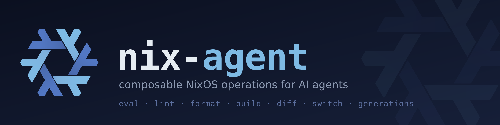

<p align="center">
  
</p>

A local MCP server that gives AI agents composable NixOS / Home Manager
operations: build, diff, switch, and generations for the operational core,
plus eval, locate, and lint for config introspection.

It pairs with [`mcp-nixos`](https://github.com/utensils/mcp-nixos). nix-agent
operates on your actual configuration, `mcp-nixos` handles package and option
discovery. Every response that ran a command reports raw vs returned bytes,
so the token savings are visible per call, not just claimed.

> **Experimental and a work in progress.** Feedback and contributions welcome.

## Install

Paste this to a coding agent (Codex, Claude Code, opencode, ...) and it does the install:

```
Read https://raw.githubusercontent.com/JEFF7712/nix-agent/main/docs/agent-install.md and follow every step to install nix-agent on this NixOS system, install the companion skills, and register nix-agent in my MCP settings for this machine.
```

Or do it by hand, see [docs/usage.md](docs/usage.md#install).

## Docs

- [docs/usage.md](docs/usage.md): install, MCP host config, tool surface, workflow, design notes
- [docs/agent-install.md](docs/agent-install.md): install guide for agents
- [docs/privileged-automation.md](docs/privileged-automation.md): non-interactive switch
- [skills/nix-agent/SKILL.md](skills/nix-agent/SKILL.md): companion workflow skill
- [skills/nix-agent-init/SKILL.md](skills/nix-agent-init/SKILL.md): repo onboarding skill

---

The nix-agent logo adapts the Nix snowflake from [NixOS/nixos-artwork](https://github.com/NixOS/nixos-artwork), licensed [CC-BY 4.0](https://creativecommons.org/licenses/by/4.0/).
